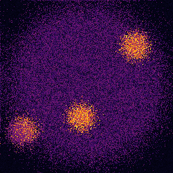
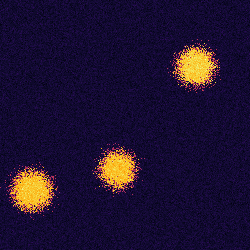

# Image Reduction
Astronomical Image Reduction, of simulated CCD/Image combo
The aim of image reduction is to take a raw image:
  
And convert it into a form suitable for scientific measurments:

In the second image, the star is much more clearly defined, and the image is less noisy. 

## Simulating Images
Using different techniques and functions from numpy library, different components of an astronomical image are simulated. These are:
1. The Bias of the CCD
2. The Dark Current in the CCD
3. Difference in sensitivity of pixels of the CCD
4. Generating several stars in the sky
5. Generating the photons coming off the stars, and a background level of radiation in the whole image
